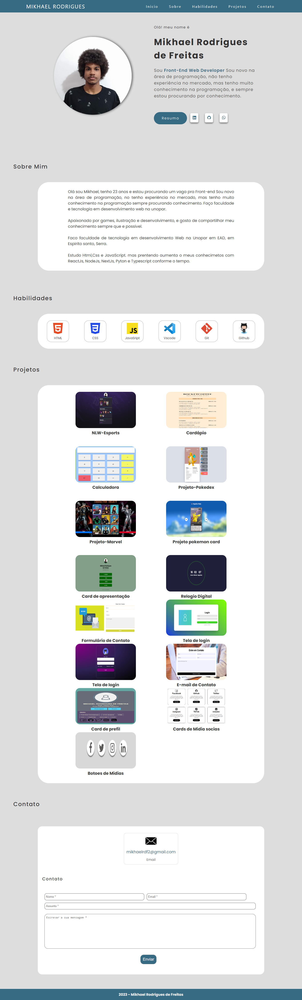

# Portfólio-Responsivo

<h2>Bem-vindo ao meu portfolio de programação! Este documento tem o objetivo de fornecer uma visão geral do meu trabalho, habilidades, sou novo na area de programação e busco o meu primeira vaga de emprego de progrmação.</h2>

  

<h2>Sobre Mim<h2>

Meu nome é mikhael rodrigues de freitas e sou faço faculdade de de tecnologia em desenvolvimento web na unopar, gosto de fazer pequenos e grande projetos  por meio da programação. Estou constantemente buscando aprender e aprimorar minhas habilidades técnicas.

  

<h2>Habilidades Técnicas</h2>

Tenho poucas habilidades, por agora mas pretendo aumentar os meus conhecimentos conforme o tempo.

<li>HTML</li>
<li>CSS</li>
<li>Javascript</li>

  

<h2>Contato</h2>

Se você tiver alguma dúvida, quiser discutir oportunidades de emprego ou obter mais informações, fique à vontade para entrar em contato comigo por e-mail ou telefone.

[Linkendin](https://www.linkedin.com/in/mikhael-rodrigues-de-freitas-448403235/)
  
[WhatsApp](https://wa.me/5527995771584)
  
[Endereço de E-mail](mailto:mikhaelrdf2@gmail.com)

